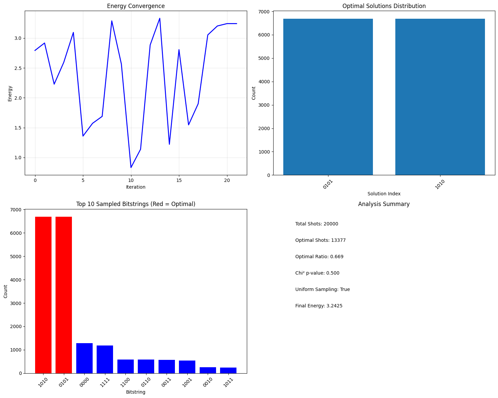

#  Max-Cut Quantum Optimization using varQITE

This project implements a quantum optimization solution for the classic **Max-Cut problem**, using **Variational Quantum Imaginary Time Evolution (varQITE)** on a 4-node graph. It was designed for the FLIQ Science Track challenge 2025 **"MAX-CUT: Ground State at Minimum Cost"**, organized by **International Telecommunication Union** on the occasion of **AI For Good's The Future Leaders in Quantum Hackathon**, although we did not submit it officially.

Max-Cut serves as a foundational benchmark in quantum optimization due to its simplicity, universality, and ability to be encoded into the Ising Hamiltonian—a natural match for NISQ hardware.

---

##  Problem Statement: Max-Cut

Given a graph  G = (V, E), the **Max-Cut** problem seeks a partition of the vertex set into two subsets such that the number of edges between the sets is maximized.

### Why Max-Cut?

- **Universality**: Can model many real-world optimization problems.
- **Scalability**: Can be extended to larger graphs.
- **Verifiability**: Classical solutions can validate quantum results.
- **Hardware-friendly**: Encodes directly into Pauli-Z operators for NISQ systems.

---

## 🔧 Methodology

This project implements a quantum optimization solution for the Max-Cut problem on a 4-node, 5-edge graph. The classical Max-Cut value for this graph is 4, with optimal solutions identified as `['0101', '1010']`.

The core methodology involves:

### 1. Graph Construction and Hamiltonian Formulation

* **Graph Definition**: A 4-vertex, 5-edge graph is used as the problem instance.
* **Hamiltonian Encoding**: The Max-Cut problem is encoded into an Ising Hamiltonian. This Hamiltonian is constructed as:
$H = \sum_{(i,j) \in E} \frac{1 - Z_i Z_j}{2}$
    where $E$ represents the set of edges, $I$ is the identity operator, and $Z_i, Z_j$ are Pauli-Z operators acting on qubits $i$ and $j$ respectively. The `MaxCutProblem` class in the notebook handles the creation of this `SparsePauliOp`.
* **Classical Verification**: A classical brute-force search is implemented to find all optimal solutions and their corresponding Max-Cut values, which serves as a benchmark for quantum results.

### 2. Quantum Ansatz Design (Multi-type Ansatz Option)

A `HardwareEfficientAnsatz` class is implemented, offering various configurations for the variational quantum circuit, including:

* **Ansatz Types**:
    * **Hardware Efficient Ansatz (HEA)**: A general-purpose ansatz with configurable layers of single-qubit rotations (RY, RZ) and two-qubit entangling gates.
    * **QAOA-like Ansatz**: Structured with alternating problem Hamiltonian (RZZ gates for edges) and mixer Hamiltonian (RX gates for all qubits) layers, typical of the Quantum Approximate Optimization Algorithm.
    * **Symmetry-Preserving Ansatz**: Designed to exploit problem symmetries. For Max-Cut, this often involves applying shared parameters (e.g., the same RY/RZ angle across all qubits) and using RZZ gates on graph edges to preserve global bit-flip symmetry.
    * **Adaptive Ansatz**: Employs a simplified ADAPT-VQE style construction, where operators are selected from a pool based on a heuristic "gradient contribution" (e.g., prioritizing operators on high-degree vertices) to build the circuit layer by layer.
* **Entangler Strategies**:
    * `graph_based`: Entangling gates are placed only on the edges defined by the problem graph.
    * `linear`: Entangles qubits in a linear chain (e.g., (0,1), (1,2), etc.).
    * `circular`: Entangles qubits in a circular fashion (e.g., (0,1), (1,2), ..., (N-1,0)).
    * `adaptive`: Dynamically computes entangling edges based on graph structure, prioritizing edges with higher centrality (e.g., based on degree).
* **Initial States**: Options to prepare the initial quantum state include 'zero' (all |0>), 'superposition' (all |+>), or 'random' states.
* **Gate Sets**: Supports different two-qubit gate choices like 'rzz' or 'cnot' (with RZ) for entangling layers.
* **Parameter Sharing**: Allows for sharing parameters across layers to reduce the total number of variational parameters.

The notebook uses Qiskit for quantum circuit construction, Hamiltonian representation (`SparsePauliOp`), and quantum simulations with `StatevectorEstimator` and `StatevectorSampler`.

### 3. Variational Quantum Imaginary Time Evolution (varQITE)

The `QITEvolver` class orchestrates the variational quantum imaginary time evolution. This method aims to find the ground state of the Hamiltonian by evolving the variational parameters in imaginary time.

* **Imaginary Time Evolution Principle**: The evolution is based on the McLachlan's Variational Principle, which seeks to minimize the distance between the quantum state's actual imaginary time evolution and the evolution generated by the variational ansatz. This leads to a system of linear equations to solve for the parameter derivatives ($\dot{\theta}$):
    $S \dot{\theta} = -C$
    where $S_{ij} = \text{Re}(\langle \partial_i \psi | \partial_j \psi \rangle)$ and $C_i = \text{Re}(\langle \partial_i \psi | H | \psi \rangle)$.
* **Implementation Details**:
    * **Hamiltonian and Ansatz Integration**: The `QITEvolver` is initialized with the problem's Hamiltonian (`SparsePauliOp`) and the chosen `HardwareEfficientAnsatz`.
    * **Energy Computation**: The `compute_energy` method uses Qiskit's `StatevectorEstimator` to calculate the expectation value of the Hamiltonian for a given set of ansatz parameters.
    * **Partial Derivatives (`_get_psi_and_partial_psi`)**: Numerical differentiation (using a finite difference approach with $\pm \pi/2$ shifts) is employed to compute the partial derivatives of the quantum state with respect to each parameter.
    * **S and C Matrix Calculation (`_compute_S_and_C`)**: These methods compute the components of the McLachlan equation. Tikhonov regularization (with parameter `beta`) is applied to the S matrix to ensure numerical stability and handle potential singularities.
    * **Parameter Update Loop (`evolve`)**:
        * **Adaptive Learning Rate**: The imaginary time step (`delta_tau`) decays exponentially over iterations to refine the search.
        * **Parameter Optimization**: In each step, the system of equations $S \dot{\theta} = -C$ is solved (using `np.linalg.solve` with a fallback to `np.linalg.pinv` for singular matrices) to obtain the parameter update directions ($\dot{\theta}$).
        * **Convergence Criteria**: The evolution stops if:
            * The norm of the C vector (related to the gradient) falls below a `tol_gradient_norm`.
            * The change in energy between consecutive steps is less than `tol_energy_diff` (energy plateau).
            * The energy has not improved for a specified number of `patience` steps.

---

### 4. **Amplitude Amplification**
   * **Max-Cut Oracle (`_build_maxcut_oracle`)**: A specific phase oracle for Max-Cut is constructed, applying controlled-phase gates (`CZ` and `CX` combinations) on each edge of the graph to flip the phase of states corresponding to "bad" cuts (where both qubits on an edge are in the same partition).

   * **Amplitude Amplification (`apply_amplitude_amplification`)**: Optionally, after the varQITE optimization, amplitude amplification can be applied using Qiskit's `GroverOperator`. This post-processing step can enhance the probability of measuring optimal solutions by iteratively amplifying their amplitudes. The `_create_amplification_problem` method is used to set up the problem for Grover's algorithm.

---

##  Results Summary

### 🔹 Energy Convergence
- Minimum energy reached: **0.831**
- Final energy: **3.242**
- Convergence occurred after 21 steps, with no improvement beyond that.

### 🔹 Sampling Results
- **Total shots**: 20,000  
- **Optimal shots**: 13,377  
- **Optimal ratio**: 66.9%  
- **Chi² test**: p = 0.500 (passed uniformity test)



### Top Sampled Bitstrings
- `'1010'` and `'0101'` dominated the sampled bitstrings.
- The sampling histogram clearly identifies the optimal solutions in **red**.

---

##  Files

- `FLIQ.ipynb` — Full quantum optimization implementation and analysis
- `result.png` — Output visualization: energy convergence, bitstring histograms, summary stats

---

##  Technologies Used

- Python
- Qiskit / PennyLane (assumed libraries)
- NumPy, Matplotlib
- Custom varQITE Class
- Amplitude Amplification Utilities

---

##  Future Work

- Scale to larger graphs (e.g., 8–16 qubits)
- Benchmark against QAOA and other VQE methods
- Deploy on actual quantum hardware or simulators with noise models
- Explore hybrid classical-quantum refinement

---

##  References

- Farhi et al. (2014) *A Quantum Approximate Optimization Algorithm*
- McArdle et al. (2019) *Variational Quantum Simulation of Imaginary Time Evolution*

---

##  Running Instructions

1. Clone the repo:
   ```bash
   git clone https://github.com/yousuftomal/fliq-maxcut-varqite.git
   ```
2. Open `FLIQ.ipynb` in Jupyter Notebook.
3. Run all cells and inspect output visualizations and convergence logs.

--- 

## Contributing

Contributions welcome! To add new features or improvements:


## License

This project is licensed under the MIT License. See [LICENSE](LICENSE) for details.

---

*Developed by S.M. Yousuf Iqbal Tomal and  Abdullah Al Shafin.*
